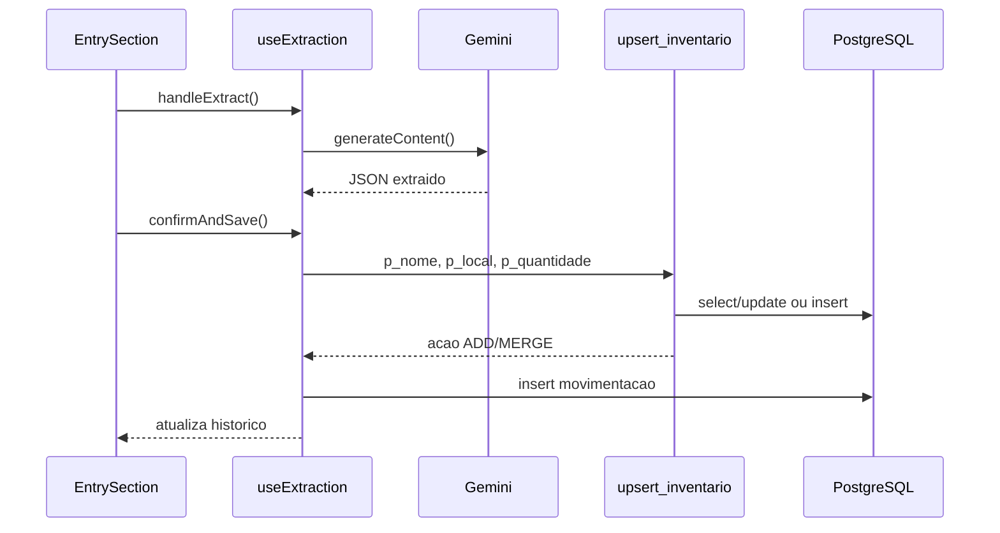

# API Documentation

## Indice

1. [Visao Geral](#visao-geral)
2. [Autenticacao](#autenticacao)
3. [Contratos OpenAPI Conceituais](#contratos-openapi-conceituais)
4. [Tabelas PostgREST](#tabelas-postgrest)
5. [RPCs](#rpcs)
6. [Payloads e Exemplos](#payloads-e-exemplos)
7. [Codigos HTTP](#codigos-http)
8. [Fluxos de Integracao](#fluxos-de-integracao)

## Visao Geral

A API consumida pelo frontend e a API Supabase:

- REST automatico via PostgREST em `/rest/v1/{table}`;
- RPC em `/rest/v1/rpc/{function}`;
- Auth em `/auth/v1/*`;
- headers gerenciados pelo Supabase JS Client.

## Autenticacao

Todas as chamadas de dados dependem do JWT da sessao Supabase.

Headers conceituais:

```http
Authorization: Bearer <jwt>
apikey: <supabase_anon_key>
Content-Type: application/json
```

## Contratos OpenAPI Conceituais

```yaml
openapi: 3.0.3
info:
  title: Ordo Domus Supabase API
  version: 1.0.0
servers:
  - url: https://{project}.supabase.co
security:
  - bearerAuth: []
paths:
  /rest/v1/rpc/upsert_inventario:
    post:
      summary: Cria ou soma item no inventario
      security:
        - bearerAuth: []
      requestBody:
        required: true
        content:
          application/json:
            schema:
              type: object
              required: [p_unidade_id, p_nome, p_categoria, p_comodo]
              properties:
                p_unidade_id: { type: string, format: uuid }
                p_nome: { type: string }
                p_categoria: { type: string }
                p_comodo: { type: string }
                p_armario: { type: string }
                p_caixa: { type: string }
                p_quantidade: { type: number }
                p_validade: { type: string }
      responses:
        "200":
          description: Resultado ADD ou MERGE
        "401":
          description: Usuario nao autenticado
        "403":
          description: Acesso negado pela RPC/RLS
```

## Tabelas PostgREST

| Tabela | Operacoes usadas | Arquivos consumidores |
| --- | --- | --- |
| `unidades` | `insert`, `select` | `Onboarding`, `useAuth` |
| `membros_unidades` | `insert`, `select` | `Onboarding`, `useAuth` |
| `itens_inventario` | `select`, `update` | `useInventory`, `GuestView` |
| `movimentacoes_inventario` | `select`, `insert` | `useExtraction`, `useInventory` |
| `importacoes_pendentes` | `select`, `insert`, `delete` | `useReceiptImport`, `useTriage`, `useExtraction` |
| `dicionario_produtos` | `select`, `upsert` | `useTriage`, `useExtraction` |

## RPCs

### `upsert_inventario`

Metodo: `POST /rest/v1/rpc/upsert_inventario`

Request:

```json
{
  "p_unidade_id": "00000000-0000-0000-0000-000000000000",
  "p_nome": "Cafe",
  "p_categoria": "Alimentos",
  "p_comodo": "Cozinha",
  "p_armario": "Armario superior",
  "p_caixa": "",
  "p_quantidade": 2,
  "p_validade": "10/12/2026"
}
```

Response:

```json
{
  "acao": "MERGE",
  "id": "11111111-1111-1111-1111-111111111111",
  "nome": "Cafe",
  "categoria": "Alimentos",
  "comodo": "Cozinha",
  "armario": "Armario superior",
  "caixa": "",
  "validade": "10/12/2026",
  "quantidade": 4
}
```

### `listar_membros`

Request:

```json
{ "p_unidade_id": "00000000-0000-0000-0000-000000000000" }
```

Response:

```json
[
  {
    "unidade_id": "00000000-0000-0000-0000-000000000000",
    "user_id": "22222222-2222-2222-2222-222222222222",
    "papel": "convidado",
    "status": "pendente",
    "adicionado_em": "2026-05-19T12:00:00Z"
  }
]
```

### `aprovar_membro`

Request:

```json
{
  "p_unidade_id": "00000000-0000-0000-0000-000000000000",
  "p_user_id": "22222222-2222-2222-2222-222222222222"
}
```

Response: `204`/payload vazio via Supabase JS.

### `get_saas_metrics`

Response:

```json
{
  "total_unidades": 10,
  "total_usuarios": 25,
  "total_itens": 430,
  "total_convites_pendentes": 3
}
```

## Payloads e Exemplos

### Inserir importacoes pendentes

```json
[
  {
    "unidade_id": "00000000-0000-0000-0000-000000000000",
    "nome_bruto": "BISC RECH CHOC 130G",
    "quantidade": 1,
    "valor_unitario": 4.99,
    "processado": false
  }
]
```

### Inserir movimentacao

```json
{
  "unidade_id": "00000000-0000-0000-0000-000000000000",
  "item_id": "11111111-1111-1111-1111-111111111111",
  "item_nome": "Cafe",
  "categoria": "Alimentos",
  "comodo": "Cozinha",
  "quantidade": 1,
  "tipo": "consumo"
}
```

## Codigos HTTP

| Codigo | Cenario |
| --- | --- |
| 200 | Select/RPC com retorno. |
| 201 | Insert com retorno. |
| 204 | Update/delete/RPC void sem payload. |
| 400 | Payload invalido ou erro PL/pgSQL. |
| 401 | Sessao ausente/expirada. |
| 403 | RLS/RPC negou acesso. |
| 409 | Violacao de unique constraint, como solicitacao duplicada. |

## Fluxos de Integracao

### Entrada confirmada



