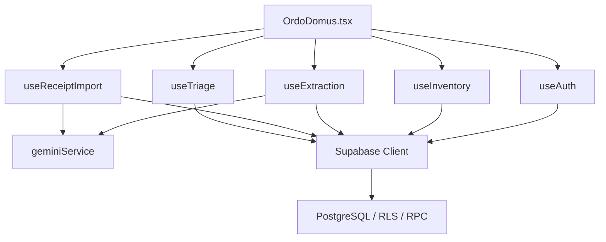

# Arquitetura Completa

## Indice

1. [Resumo Arquitetural](#resumo-arquitetural)
2. [Camadas](#camadas)
3. [Entrypoints](#entrypoints)
4. [Modulos e Responsabilidades](#modulos-e-responsabilidades)
5. [Comunicacao entre Modulos](#comunicacao-entre-modulos)
6. [Backend Supabase](#backend-supabase)
7. [Padroes Utilizados](#padroes-utilizados)
8. [Dependencias](#dependencias)
9. [Problemas Arquiteturais](#problemas-arquiteturais)
10. [Melhorias Recomendadas](#melhorias-recomendadas)

## Resumo Arquitetural

O Ordo Domus segue uma arquitetura SPA client-heavy com backend como servico. O frontend concentra apresentacao, estado de tela, chamadas a IA e orquestracao de fluxos. O Supabase concentra autenticacao, autorizacao, persistencia, auditoria e regras atomicas via RPC.

Nao foi encontrado servidor Express, API REST propria, middleware HTTP proprio ou processo backend Node. A dependencia `express` esta no `package.json`, mas nao e usada pelos entrypoints atuais.

## Camadas

| Camada | Arquivos principais | Responsabilidade |
| --- | --- | --- |
| Bootstrap | `src/main.tsx`, `index.html` | Montar React no DOM. |
| Shell da aplicacao | `src/OrdoDomus.tsx` | Coordenar auth, unidade ativa, abas, modais e hooks. |
| UI components | `src/components/*.tsx`, `components/ui/*.tsx` | Renderizar interface, formularios, cards, tabelas, dashboard e modais. |
| Hooks de dominio | `src/hooks/*.ts` | Encapsular efeitos, estado e chamadas Supabase/Gemini. |
| Servicos externos | `src/services/geminiService.ts`, `src/lib/supabaseClient.ts` | Clientes de IA e Supabase. |
| Utilitarios | `src/lib/utils.ts` | Formatacao, classificacao e compressao de imagem. |
| Banco/RPC/RLS | `CriarSQL.sql`, `sql/*.sql` | Schema, indices, politicas e funcoes PL/pgSQL. |

## Entrypoints

### Frontend

`src/main.tsx`:

```tsx
createRoot(document.getElementById('root')!).render(
  <StrictMode>
    <OrdoDomus />
  </StrictMode>,
);
```

### Aplicacao

`src/OrdoDomus.tsx` e o componente raiz funcional. Ele instancia:

- `useAuth`
- `useInventory`
- `useExtraction`
- `useReceiptImport`
- `useTriage`

Tambem controla:

- aba ativa: `entrada`, `inventario`, `dashboard`, `saas-admin`
- modo consumo
- modais de admin, confirmacao e triagem
- selecao da unidade ativa

## Modulos e Responsabilidades

| Modulo | Responsabilidade |
| --- | --- |
| `useAuth` | Sessao, usuario atual, unidades aprovadas, super-admin, logout e contagem de pendentes. |
| `useInventory` | Carregar inventario, editar item, soft delete, consumir item, desfazer consumo e registrar auditoria. |
| `useExtraction` | Capturar texto/audio, chamar Gemini, normalizar resultado, confirmar e salvar via RPC. |
| `useReceiptImport` | Capturar imagem, comprimir WebP, chamar Gemini OCR e inserir itens em triagem. |
| `useTriage` | Buscar pendentes, aplicar smart match com dicionario e descartar itens. |
| `geminiService` | Prompts, schemas JSON, timeouts e fallback de modelos Gemini. |
| `AdminPanel` | Listar membros, aprovar, rejeitar/remover e copiar codigo da unidade. |
| `InventoryDashboard` | KPIs, graficos, validade, estoque critico e linha do tempo. |
| `SaasAdminDashboard` | Metricas globais para `system_admins`. |

## Comunicacao entre Modulos



## Backend Supabase

O backend efetivo possui tres superficies:

1. Tabelas acessadas por PostgREST:
   - `unidades`
   - `membros_unidades`
   - `itens_inventario`
   - `movimentacoes_inventario`
   - `importacoes_pendentes`
   - `dicionario_produtos`
   - `system_admins`

2. RPCs:
   - `upsert_inventario`
   - `listar_pendentes`
   - `listar_membros`
   - `aprovar_membro`
   - `rejeitar_membro`
   - `is_system_admin`
   - `get_saas_metrics`

3. RLS:
   - isolamento por `unidade_id`
   - visibilidade apenas para membros aprovados
   - funcoes `SECURITY DEFINER` para operacoes administrativas

## Padroes Utilizados

| Padrao | Onde aparece | Avaliacao |
| --- | --- | --- |
| Container/root orchestration | `OrdoDomus.tsx` | Simples e direto, mas tende a crescer demais. |
| Custom hooks | `src/hooks` | Boa separacao entre UI e efeitos. Precisa tipagem forte. |
| Backend-as-a-Service | Supabase | Adequado para MVP/SaaS leve. |
| RPC para regra atomica | `upsert_inventario`, admin RPCs | Correto para consistencia e autorizacao. |
| Soft delete | `itens_inventario.deletado_em` | Mantem auditoria, mas requer filtros consistentes. |
| Smart Match | `dicionario_produtos` | Boa memoria de correcao por unidade. |
| Optimistic/UI feedback | `toast`, estado local | Boa experiencia, mas sem rollback formal. |

## Dependencias

Dependencias principais detectadas:

| Pacote | Uso |
| --- | --- |
| `react`, `react-dom` | SPA. |
| `vite`, `@vitejs/plugin-react` | Build/dev server. |
| `@supabase/supabase-js` | Auth, PostgREST e RPC. |
| Supabase Edge Function `extract-inventory` | Ponte server-side entre frontend autenticado e Gemini. |
| `tailwindcss`, `@tailwindcss/vite` | Estilizacao. |
| `lucide-react` | Iconografia. |
| `motion` | Animacoes. |
| `recharts` | Graficos do dashboard. |
| `sonner` | Toasts. |
| `class-variance-authority`, `clsx`, `tailwind-merge` | Componentes shadcn/ui. |

## Problemas Arquiteturais

| Problema | Impacto |
| --- | --- |
| IA chamada do cliente | Exposicao de chave, impossibilidade de rate limit confiavel, risco de abuso. |
| `OrdoDomus.tsx` concentra muitas decisoes | Dificulta manutencao conforme novas features entram. |
| Dominio tipado como `any` | Bugs silenciosos em campos, payloads e respostas RPC. |
| SQL nao versionado formalmente | Risco de ambientes divergentes. |
| Scripts com nomes de tabela divergentes | `membros_unidade` vs `membros_unidades` pode quebrar operacoes. |
| Datas como texto | Dificulta filtros server-side e validacoes por banco. |
| Falta de testes | Regressao em regras multi-tenant e inventario. |

## Melhorias Recomendadas

1. Criar Edge Functions Supabase para chamadas Gemini.
2. Gerar tipos Supabase com `supabase gen types typescript`.
3. Introduzir camada de dominio: `InventoryItem`, `Movement`, `Unit`, `Member`, `PendingImport`.
4. Separar `OrdoDomus.tsx` em roteador/tab shell e providers.
5. Consolidar migrations usando Supabase CLI.
6. Migrar `validade` de `text` para `date` ou adicionar campo derivado `validade_date`.
7. Adicionar testes E2E para fluxos criticos.
