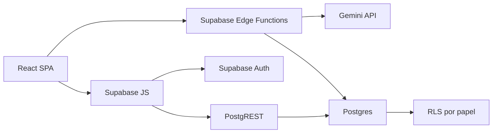

# Auditoria Multidisciplinar Completa - Ordo Domus

## Indice

1. [Resumo Executivo](#resumo-executivo)
2. [Nota Geral do Projeto](#nota-geral-do-projeto)
3. [Pontos Fortes](#pontos-fortes)
4. [Principais Problemas](#principais-problemas)
5. [Riscos Criticos](#riscos-criticos)
6. [Melhorias Prioritarias](#melhorias-prioritarias)
7. [Melhorias de Medio Prazo](#melhorias-de-medio-prazo)
8. [Melhorias Futuras](#melhorias-futuras)
9. [Roadmap Tecnico](#roadmap-tecnico)
10. [Roadmap de Produto](#roadmap-de-produto)
11. [Lista de Vulnerabilidades](#lista-de-vulnerabilidades)
12. [Lista de Refatoracoes](#lista-de-refatoracoes)
13. [Sugestoes de Features](#sugestoes-de-features)
14. [Sugestoes de Arquitetura](#sugestoes-de-arquitetura)
15. [Sugestoes de UX/UI](#sugestoes-de-uxui)
16. [Sugestoes de Performance](#sugestoes-de-performance)
17. [Sugestoes de Seguranca](#sugestoes-de-seguranca)
18. [Sugestoes DevOps](#sugestoes-devops)
19. [Analise de Tecnologias](#analise-de-tecnologias)
20. [Avaliacao Final](#avaliacao-final)

## Resumo Executivo

O Ordo Domus e um MVP funcional e promissor de inventario domestico inteligente. O produto tem uma proposta clara: reduzir o atrito de cadastrar, localizar e consumir itens por unidade/casa usando IA, voz, texto, cupom fiscal e Supabase.

Tecnicamente, o projeto esta em um estagio intermediario de maturidade. A UI esta bem encaminhada, os fluxos centrais existem e o uso de Supabase com RLS e RPCs e adequado para o tamanho atual. O problema e que algumas decisoes de MVP hoje viraram riscos reais para producao: chave Gemini exposta no cliente, autorizacao divergente entre UI e RLS, migrations SQL inconsistentes, ausencia de testes, ausencia de CI/CD e dependencias transitivas vulneraveis.

A arquitetura atual funciona para um produto inicial, mas ainda nao esta pronta para escala, seguranca forte ou operacao SaaS profissional. O caminho recomendado nao e migrar para microservicos; e endurecer a base atual: Edge Functions para IA, migrations versionadas, RLS por papel, tipos gerados do Supabase, testes automatizados, observabilidade e um pipeline de deploy minimo.

## Nota Geral do Projeto

**Nota geral: 6.2 / 10**

| Dimensao | Nota | Justificativa |
| --- | ---: | --- |
| Produto | 7.5 | Proposta diferenciada, bom encaixe de IA e problema real. |
| UX/UI | 7.0 | Interface moderna e funcional, mas precisa acessibilidade, consistencia e fluxos de massa. |
| Arquitetura | 6.0 | Boa base SPA + Supabase, mas excesso no cliente e falta de separacao mais madura. |
| Seguranca | 4.0 | RLS existe, mas segredo Gemini no cliente e permissoes por papel sao problemas graves. |
| Performance | 6.5 | Adequado para MVP; limita com inventarios grandes e dashboard client-side. |
| Qualidade de codigo | 5.5 | TypeScript passa, mas ha muito `any`, logs ruidosos e pouca modelagem de dominio. |
| DevOps/SRE | 3.5 | Sem CI/CD, sem observabilidade, sem backup/rollback documentado por pipeline. |
| Testes/QA | 2.0 | Nao ha testes automatizados; apenas `tsc --noEmit`. |
| Escalabilidade | 5.5 | Multi-tenant por RLS e bom inicio; falta fila, cache, server-side workloads e particionamento futuro. |

## Pontos Fortes

| Area | Ponto forte |
| --- | --- |
| Produto | Problema bem definido: inventario domestico com localizacao, validade e consumo. |
| IA | Uso pratico de Gemini para texto, audio e cupom fiscal, com response schema. |
| Multi-tenant | Modelo de unidade/membro e RLS indicam direcao correta. |
| Banco | RPC `upsert_inventario` centraliza regra atomica de merge. |
| UX | Entrada por voz/texto/cupom reduz atrito real. |
| Dashboard | KPIs, validade e reposicao ajudam o usuario a agir. |
| Auditoria | `movimentacoes_inventario` cria linha do tempo operacional. |
| Build | `npm run lint` passa com `tsc --noEmit`. |
| Documentacao | A pasta `docs/` agora tem base tecnica estruturada. |

## Principais Problemas

| Prioridade | Problema | Impacto |
| --- | --- | --- |
| P0 | ✅ `VITE_GEMINI_API_KEY` usado no frontend | Resolvido: Gemini foi movido para Edge Function server-side. |
| P0 | ✅ RLS permite escrita para qualquer membro aprovado | Resolvido: RLS por papel foi aplicada manualmente no Supabase. |
| P0 | Scripts SQL divergentes `membros_unidade` vs `membros_unidades` | Risco de quebrar migrations, policies e RPCs em ambientes diferentes. |
| P1 | ✅ Sem testes automatizados | Parcialmente resolvido: Vitest e testes unitarios iniciais adicionados; E2E ainda pendente. |
| P1 | ✅ `npm audit` com 2 high e 7 moderate | Resolvido para high severity: `npm audit --audit-level=high` retorna 0 vulnerabilidades. |
| P1 | ✅ Movimentacoes sem `user_id` | Resolvido: coluna e escrita de `user_id` aplicadas. |
| P1 | ✅ Sem CI/CD e rollback formal | Parcialmente resolvido: CI minimo criado; rollback formal ainda pendente. |
| P2 | ✅ Muitos `any` | Resolvido nos modulos analisados: hooks, components, services, lib e repositories. |
| P2 | ✅ Dashboard/listagens processam tudo no cliente | Dashboard resolvido com RPC server-side; inventario agora usa paginacao/filtros server-side. |
| P2 | ✅ Validade armazenada como texto | Mitigado: `validade_date` normalizada foi adicionada e aplicada. |

## Riscos Criticos

### 1. Chave Gemini exposta no bundle

Criticidade: **Alta**

Evidencia:

```ts
const ai = new GoogleGenAI({ apiKey: import.meta.env.VITE_GEMINI_API_KEY });
```

Impacto:

- qualquer usuario consegue extrair a chave do bundle;
- consumo indevido da API Gemini;
- impossibilidade de aplicar quota por usuario/unidade;
- exposicao de prompts e arquitetura de IA.

Correcao:

- mover chamadas Gemini para Supabase Edge Function ou backend server-side;
- frontend envia texto/audio/imagem para endpoint autenticado;
- endpoint valida JWT, unidade, permissao, tamanho de payload e rate limit;
- segredo fica como `GEMINI_API_KEY` server-side.

### 2. Autorizacao real mais permissiva que UX

Criticidade: **Alta**

A UI trata convidado como leitura, mas a policy consolidada de `itens_inventario` usa membro aprovado, sem diferenciar `papel`.

Impacto:

- convidado aprovado pode fazer `update`, `insert` ou `delete` se chamar Supabase diretamente;
- viola principio de menor privilegio;
- risco de alteracao maliciosa ou acidental.

Correcao:

```sql
create policy "Admins write inventory"
on itens_inventario for all
using (
  exists (
    select 1 from membros_unidades m
    where m.unidade_id = itens_inventario.unidade_id
      and m.user_id = auth.uid()
      and m.status = 'aprovado'
      and m.papel = 'admin'
  )
)
with check (
  exists (
    select 1 from membros_unidades m
    where m.unidade_id = itens_inventario.unidade_id
      and m.user_id = auth.uid()
      and m.status = 'aprovado'
      and m.papel = 'admin'
  )
);
```

### 3. Banco sem migration strategy confiavel

Criticidade: **Alta**

Ha scripts SQL historicos usando `membros_unidade`, enquanto o schema principal e o frontend usam `membros_unidades`.

Impacto:

- ambiente novo pode nascer quebrado;
- RPC pode apontar para tabela inexistente;
- RLS pode nao ser aplicada;
- debugging caro.

Correcao:

- adotar Supabase CLI;
- criar migrations sequenciais em `supabase/migrations`;
- arquivar scripts historicos em `docs/sql-history` ou remover do caminho operacional;
- adicionar teste de migration em CI.

## Melhorias Prioritarias

| Prioridade | Acao | Resultado esperado |
| --- | --- | --- |
| P0 | ✅ Criar Edge Function `extract-inventory` para Gemini | Remove segredo do cliente e permite controle de abuso. |
| P0 | ✅ Revisar RLS por papel | Garante permissao real coerente com UX. |
| P0 | Consolidar migrations Supabase | Ambientes reproduziveis. |
| P1 | ✅ Atualizar dependencias vulneraveis | Reduz risco supply chain. |
| P1 | ✅ Adicionar `user_id` em movimentacoes | Auditoria real. |
| P1 | Configurar Vitest + Playwright | Base minima de QA. |
| P1 | ✅ Criar CI com `npm ci`, `tsc`, `build`, `test` | Evita regressao basica. |
| P1 | ✅ Tipar entidades Supabase | Reduz erros em payloads e UI. |

## Melhorias de Medio Prazo

1. ✅ Migrar `validade` para `date` ou criar campo `validade_date`.
2. Separar `OrdoDomus.tsx` em `AppShell`, `AuthGate`, `UnitGate`, `MainTabs`.
3. Criar camada de dominio:
   - `types/inventory.ts`
   - `types/unit.ts`
   - `types/movement.ts`
   - `repositories/supabaseInventoryRepository.ts`
4. ✅ Criar agregacoes server-side para dashboard.
5. Implementar limpeza automatica de `importacoes_pendentes.expires_at`.
6. Adicionar Error Boundary e logging remoto.
7. Criar tela de configuracoes da unidade.
8. Melhorar triagem com acoes em massa.

## Melhorias Futuras

1. Offline-first/PWA com fila local de sincronizacao.
2. Notificacoes push para validade e estoque baixo.
3. Compartilhamento de listas de compra.
4. Plano premium com multiunidade, historico estendido e analytics.
5. OCR server-side com pipeline assíncrono.
6. Recomendacoes preditivas de reposicao.
7. Internacionalizacao.
8. Exportacao/importacao CSV.
9. Integracao com assistentes de voz.
10. API publica para integracoes.

## Roadmap Tecnico

### Fase 0 - Hardening imediato

Prazo sugerido: 1 a 2 semanas.

| Item | Entrega |
| --- | --- |
| Edge Function Gemini | `VITE_GEMINI_API_KEY` removido do client. |
| RLS por papel | Convidado read-only garantido pelo banco. |
| Migrations | Schema versionado e scripts antigos saneados. |
| Audit dependency | `npm audit` sem high severity. |

### Fase 1 - Qualidade e confiabilidade

Prazo sugerido: 2 a 4 semanas.

| Item | Entrega |
| --- | --- |
| Tipos Supabase | Contratos sem `any` nos fluxos principais. |
| Testes unitarios | `utils`, services e hooks basicos. |
| Testes E2E | Login, unidade, entrada, consumo, triagem. |
| CI | Pull request bloqueado por typecheck/build/test. |

### Fase 2 - Escala operacional

Prazo sugerido: 1 a 2 meses.

| Item | Entrega |
| --- | --- |
| Observabilidade | Sentry/Logflare e alertas minimos. |
| Dashboard server-side | Agregacoes por RPC/view. |
| Limpeza pendencias | Cron/Edge scheduled job. |
| Performance | Paginacao/filtros server-side. |

### Fase 3 - SaaS

Prazo sugerido: 3 a 6 meses.

| Item | Entrega |
| --- | --- |
| Billing | Planos free/premium. |
| Convites robustos | Links expiraveis e revogaveis. |
| Auditoria avancada | Eventos por usuario e origem. |
| Backup/export | Autonomia e confianca para usuario. |

## Roadmap de Produto

### Quick wins

| Feature | Impacto |
| --- | --- |
| Lista de compras automatica por estoque baixo | Alto valor diario. |
| Filtros por validade/categoria/comodo | Melhora descoberta. |
| Acoes em massa na triagem de cupom | Reduz fadiga em compras grandes. |
| Sugestoes de local baseadas no historico | Usa dicionario existente. |
| Estado vazio melhor por tela | Ajuda onboarding e retencao. |

### Alto impacto

| Feature | Racional |
| --- | --- |
| Notificacoes de validade | Aumenta retorno ao app. |
| PWA offline | Inventario domestico precisa funcionar em despensa/garagem com rede ruim. |
| Compartilhamento familiar com permissoes granulares | Diferencial para uso real em casa. |
| Compra recorrente inteligente | Monetizavel e defensavel. |
| Analytics de consumo | Ajuda economia domestica. |

### Premium/monetizacao

- multiunidades ilimitadas;
- historico ilimitado;
- alertas avancados;
- relatorios mensais;
- exportacao;
- backup;
- importacao massiva;
- automacoes com IA;
- suporte familiar/equipe.

## Lista de Vulnerabilidades

Resultado local de `npm audit --json` com `NODE_OPTIONS=--use-system-ca`:

| Pacote | Severidade | Tipo | Correcao |
| --- | --- | --- | --- |
| `protobufjs` | High | Code injection / prototype pollution / DoS | Atualizar cadeia que traz `protobufjs`; rodar `npm audit fix` em branch. |
| `fast-uri` | High | Path traversal / host confusion | Atualizar dependencia transitiva. |
| `@protobufjs/utf8` | Moderate | Overlong UTF-8 decoding | Atualizar cadeia protobuf. |
| `brace-expansion` | Moderate | DoS por range grande | Atualizar para versao corrigida. |
| `express-rate-limit` | Moderate | Herda vulnerabilidade de `ip-address` | Atualizar ou remover se nao usado. |
| `ip-address` | Moderate | XSS em metodos HTML | Atualizar cadeia. |
| `hono` | Moderate | CSS/HTML injection, cache leakage, bodyLimit bypass | Atualizar cadeia. |
| `postcss` | Moderate | XSS em stringify CSS | Atualizar. |
| `ws` | Moderate | Memory disclosure | Atualizar. |

Observacoes:

- varias vulnerabilidades sao transitivas;
- `express` parece nao ser usado no app atual, entao dependencias relacionadas a servidor devem ser removidas se forem desnecessarias;
- rodar `npm audit fix` deve ser feito em branch e validado com `npm run build` e testes.

## Lista de Refatoracoes

| Prioridade | Refatoracao | Motivo |
| --- | --- | --- |
| P0 | ✅ Remover Gemini do cliente | Seguranca e custo. |
| P0 | ✅ RLS por papel | Autorizacao real. |
| P1 | ✅ Tipar modelos de dominio | Reduzir `any`. |
| P1 | Dividir `OrdoDomus.tsx` | Reduzir acoplamento do shell. |
| P1 | Consolidar `supabaseClient` duplicado | Evitar configuracoes divergentes. |
| P1 | ✅ Remover dependencias nao usadas | Reduzir superficie supply chain. |
| P2 | ✅ Criar repositories/services | Iniciado em inventario, dashboard, movimentacoes e auth basico; dominios restantes seguem pendentes. |
| P2 | ✅ Substituir logs por logger controlado | Evitar dados sensiveis no console. |
| P2 | ✅ Migrar validade para tipo de data | Melhor query e consistencia. |

## Sugestoes de Features

### IA

- classificacao automatica de categoria/comodo com aprendizado por unidade;
- sugestao de reposicao baseada em consumo;
- normalizacao inteligente de nomes de cupom;
- reconhecimento de codigo de barras;
- assistente "o que esta vencendo esta semana?";
- importacao por foto de prateleira.

### Operacionais

- lista de compras;
- alertas de validade;
- alertas de estoque minimo;
- regras de estoque minimo por item;
- exportacao CSV;
- backup por unidade;
- historico por usuario.

### Colaboracao

- permissoes granulares: admin, editor, viewer;
- links de convite expiraveis;
- auditoria de membros;
- comentarios/notas em item.

### Monetizacao

- plano free limitado por unidades/itens;
- premium com IA ilimitada, alertas, relatorios e multiunidade;
- plano familia;
- plano pequenos negocios/depositos.

## Sugestoes de Arquitetura

### Arquitetura alvo recomendada



Diretrizes:

- manter Supabase como backend principal;
- nao criar microservicos agora;
- mover apenas workloads sensiveis/server-side para Edge Functions;
- centralizar regras atomicas no banco ou functions;
- usar RLS como camada obrigatoria, nao apenas UI.

### Estrutura de pastas sugerida

```text
src/
  app/
    OrdoDomus.tsx
    AppShell.tsx
    AuthGate.tsx
    UnitGate.tsx
  components/
    inventory/
    admin/
    triage/
    dashboard/
    ui/
  hooks/
  lib/
    supabase/
    gemini/
  services/
  repositories/
  types/
  utils/
supabase/
  migrations/
  functions/
```

## Sugestoes de UX/UI

| Area | Problema | Melhoria |
| --- | --- | --- |
| Onboarding | Usuario precisa entender unidade/codigo | Wizard de 2 passos com exemplo visual. |
| Triagem | Lista grande causa fadiga | Selecionar varios e aplicar local/categoria em massa. |
| Inventario | Busca simples | Filtros por categoria, validade, comodo e quantidade. |
| Erros | Mensagens tecnicas podem escapar | Padronizar error states por fluxo. |
| Acessibilidade | Icon buttons dependem de title | Usar `aria-label`, foco visivel, contraste testado. |
| Mobile | Cards e modais densos | Testar viewport pequeno com Playwright e ajustar tap targets. |
| Retencao | App depende de acao manual | Alertas de validade/estoque e resumo semanal. |
| Dark mode | Variaveis existem, mas fluxo nao parece exposto | Adicionar toggle e testar contraste. |

## Sugestoes de Performance

| Prioridade | Otimizacao |
| --- | --- |
| P1 | ✅ Memoizar agregacoes do dashboard com `useMemo`. |
| P1 | ✅ Server-side pagination/filter para inventario grande. |
| P1 | Lazy load de `SaasAdminDashboard`, dashboard e modais pesados. |
| P1 | ✅ Remover dependencias nao usadas para reduzir bundle. |
| P2 | ✅ Criar RPCs agregadas para KPIs. |
| P2 | Usar cache controlado por unidade para inventario. |
| P2 | Virtualizar listas se passar de centenas de itens. |
| P3 | PWA com cache offline e sync queue. |

## Sugestoes de Seguranca

1. Mover Gemini para backend.
2. Adicionar rate limit por usuario e unidade.
3. Revisar RLS para papel e status.
4. Adicionar `user_id` em auditoria.
5. ✅ Remover logs com payloads sensiveis de cupom/inventario.
6. Configurar security headers na hospedagem:
   - `Content-Security-Policy`
   - `X-Content-Type-Options`
   - `Referrer-Policy`
   - `Permissions-Policy`
7. Fazer dependency scanning em CI.
8. Fixar `search_path` em funcoes `SECURITY DEFINER`.
9. Validar tamanho e MIME de upload antes de processar.
10. Criar consentimento explicito para envio de cupom/imagem a IA.

## Sugestoes DevOps

### Pipeline minimo

```yaml
name: ci
on: [pull_request, push]
jobs:
  verify:
    runs-on: ubuntu-latest
    steps:
      - uses: actions/checkout@v4
      - uses: actions/setup-node@v4
        with:
          node-version: 22
          cache: npm
      - run: npm ci
      - run: npm run lint
      - run: npm run build
      - run: npm audit --audit-level=high
```

### Operacao

- usar ambientes `dev`, `staging`, `prod`;
- migrations via Supabase CLI;
- backups automáticos Supabase;
- rollback por deploy preview/anterior;
- Sentry para frontend;
- Logflare/Supabase logs para functions;
- alertas de erro e custo Gemini.

## Analise de Tecnologias

| Tecnologia | Papel | Maturidade | Riscos | Recomendacao |
| --- | --- | --- | --- | --- |
| React 19 | UI SPA | Alta | Ecossistema ainda ajustando React 19 em libs | Manter. |
| Vite 6 | Build/dev | Alta | Pouco risco | Manter. |
| TypeScript 5.8 | Tipagem | Alta | Subutilizado por `any` | Fortalecer. |
| Supabase | Auth, DB, API | Alta para MVP/SaaS inicial | RLS mal configurado causa vazamento | Manter com hardening. |
| PostgreSQL | Banco | Alta | Schema sem migrations e datas textuais | Manter, melhorar modelagem. |
| Gemini | IA | Alta capacidade | Chave exposta, custo, dependencia externa | Mover server-side. |
| Tailwind 4 | Estilo | Alta | Consistencia depende de disciplina | Manter. |
| shadcn/ui | Componentes | Boa | Componentes locais exigem manutencao | Manter. |
| Recharts | Graficos | Boa | Pode pesar em bundle | Lazy load/dashboard split. |
| motion | Animacoes | Boa | Overuse afeta performance | Usar com parcimonia. |
| sonner | Toasts | Boa | Sem risco relevante | Manter. |
| express | Nao usado | Alta | Superficie supply chain desnecessaria | Remover se confirmado. |

## Avaliacao Final

O projeto tem base suficiente para continuar evoluindo, mas nao deve ser tratado como pronto para producao SaaS sem uma rodada de hardening. A prioridade deve ser objetiva:

1. proteger segredos e chamadas de IA;
2. corrigir autorizacao real no banco;
3. consolidar migrations;
4. criar testes para fluxos criticos;
5. estabelecer CI/CD e observabilidade.

Depois disso, o produto pode crescer com boa eficiencia. A proposta tem potencial: entrada multimodal, inventario familiar, validade, consumo e lista de compras automatica formam um conjunto competitivo. O diferencial defensavel sera a qualidade da experiencia de captura e a inteligencia acumulada por unidade, nao apenas a existencia de um CRUD de inventario.

## Verificacoes Executadas

| Comando | Resultado |
| --- | --- |
| `npm run lint` | Passou (`tsc --noEmit`). |
| `npm audit --json` | 9 vulnerabilidades: 2 high, 7 moderate. |
| `rg` para `any`, logs e SQL divergente | Encontrou uso amplo de `any`, muitos `console.log`, uso de `VITE_GEMINI_API_KEY` e scripts com `membros_unidade`. |

## Atualizacao P0 Implementada no Repositorio

Status: implementado e aplicado no Supabase. A Edge Function foi deployada, o secret `GEMINI_API_KEY` foi configurado, o app local validou o fluxo e a migration RLS foi aplicada manualmente pelo SQL Editor.

| Item P0 | Status |
| --- | --- |
| Remover Gemini do cliente | Implementado em `src/services/geminiService.ts`; o frontend agora chama `supabase.functions.invoke('extract-inventory')`. |
| Criar Edge Function Gemini | Implementado em `supabase/functions/extract-inventory/index.ts`. |
| RLS por papel | Implementado em `supabase/migrations/20260519150000_harden_rls_roles.sql` e aplicado manualmente no SQL Editor. |
| Remover dependencia `@google/genai` do bundle | Implementado via `npm uninstall @google/genai`. |
| Validar build | `npm run lint` e `npm run build` passaram apos a mudanca. |
| Reduzir audit | `npm audit` caiu para 7 vulnerabilidades transitivas: 1 high e 6 moderate. |

Proximos comandos operacionais:

```powershell
supabase secrets set GEMINI_API_KEY=SEU_VALOR
supabase functions deploy extract-inventory
supabase db push
```

Observacao: como o SQL foi aplicado manualmente, o historico local/remoto de migrations pode ficar fora de sincronia ate reconciliacao posterior.

## Atualizacao P1 Implementada no Repositorio

Status: implementado no repositorio e aplicado manualmente no Supabase, conforme validacao operacional informada.

| Item P1 | Status |
| --- | --- |
| Reduzir dependencias vulneraveis | Removidos `shadcn`, `express`, `dotenv` e `@types/express`; CSS necessario do shadcn foi incorporado localmente. |
| Auditoria com `user_id` | Implementado no codigo e em `supabase/migrations/20260519162000_add_user_id_to_movements.sql`. |
| Testes unitarios | Adicionado `vitest` e `src/lib/utils.test.ts`. |
| CI/CD minimo | Adicionado `.github/workflows/ci.yml` com install, typecheck, test, build e audit high. |

## Atualizacao P2 Iniciada no Repositorio

Status: implementado no repositorio e aplicado manualmente no Supabase.

| Item P2 | Status |
| --- | --- |
| Tipos de dominio | Implementado em `src/types/domain.ts`. |
| Remover `any` em hooks/componentes/servicos/lib analisados | Implementado; `rg "\bany\b" src\hooks src\components src\services src\lib -n` nao encontrou ocorrencias. |
| Memoizar dashboard | Implementado em `src/components/InventoryDashboard.tsx` com `useMemo`. |
| Validade como data consultavel | Implementado via `validade_date`, parser, trigger e indice parcial em migration versionada; aplicado manualmente no Supabase. |
| Validacao | `npm run lint`, `npm test`, `npm run build` e `npm audit --audit-level=high` passaram. |

## Atualizacao P2.4 Implementada no Repositorio

Status: implementado localmente. Nao exige migration SQL.

| Item P2.4 | Status |
| --- | --- |
| Logger controlado | Implementado em `src/lib/logger.ts`. |
| Remover payloads de IA/inventario dos logs | Implementado em `src/hooks/useExtraction.ts`. |
| Remover payloads de cupom dos logs | Implementado em `src/hooks/useReceiptImport.ts`. |
| Sanitizar logs de auth | Implementado em `src/components/Auth.tsx` e `src/hooks/useAuth.ts`. |
| Sanitizar erros brutos de hooks/componentes | Implementado em inventario, triagem, onboarding, guest view e SaaS admin. |
| Validacao | `npm run lint`, `npm test`, `npm run build`, `npm audit --audit-level=high` passaram; `console.*` direto restou apenas no logger central. |

## Atualizacao P2.3 Implementada no Repositorio

Status: implementado localmente. Nao exige migration SQL.

| Item P2.3 | Status |
| --- | --- |
| Repository de auth | Implementado em `src/repositories/authRepository.ts`. |
| Repository de movimentacoes | Implementado em `src/repositories/movementRepository.ts`. |
| Repository de mutacoes de inventario | Implementado em `src/repositories/inventoryMutationRepository.ts`. |
| Service de inventario | Implementado em `src/services/inventoryService.ts`. |
| Refatoracao do `useInventory` | Hook passou a delegar mutacoes para service/repository. |
| Refatoracao parcial do `useExtraction` | Upsert, leitura e escrita de movimentacoes usam repositories. |
| Validacao | `npm run lint`, `npm test`, `npm run build` e `npm audit --audit-level=high` passaram. |

## Atualizacao P2.2 Implementada no Repositorio

Status: implementado no repositorio e aplicado manualmente no Supabase.

| Item P2.2 | Status |
| --- | --- |
| Repository server-side de inventario | Implementado em `src/repositories/inventoryRepository.ts`. |
| Paginacao no hook | Implementado em `src/hooks/useInventory.ts`. |
| Filtros server-side | Busca, categoria, comodo, validade e estoque critico. |
| UI de filtros e paginacao | Implementado em `src/components/InventoryList.tsx`. |
| Indices de apoio | Implementados em migration versionada e aplicados manualmente. |
| Validacao | `npm run lint`, `npm test`, `npm run build` e `npm audit --audit-level=high` passaram. |

## Atualizacao P2.1 Implementada no Repositorio

Status: implementado no repositorio e aplicado manualmente no Supabase.

| Item P2.1 | Status |
| --- | --- |
| RPC server-side para dashboard | Implementado em `public.get_dashboard_metrics(uuid)` e aplicado manualmente. |
| Checagem multi-tenant na RPC | Implementado com `auth.uid()` e membro aprovado na unidade. |
| Repository de dashboard | Implementado em `src/repositories/dashboardRepository.ts`. |
| Hook de dashboard | Implementado em `src/hooks/useDashboardMetrics.ts`. |
| Fallback local no dashboard | Implementado em `src/components/InventoryDashboard.tsx`. |
| Validacao | `npm run lint`, `npm test`, `npm run build` e `npm audit --audit-level=high` passaram. |
