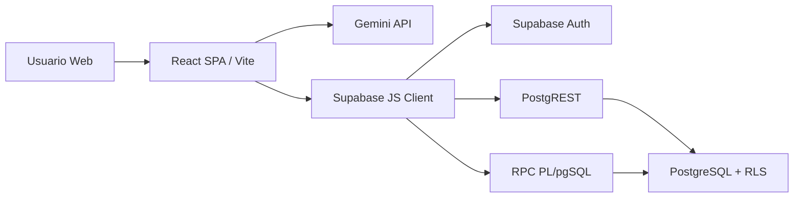

# README Executivo

## Indice

1. [Objetivo](#objetivo)
2. [Publico e Problema](#publico-e-problema)
3. [Funcionalidades](#funcionalidades)
4. [Arquitetura Geral](#arquitetura-geral)
5. [Stack Tecnologica](#stack-tecnologica)
6. [Visao Macro dos Fluxos](#visao-macro-dos-fluxos)
7. [Principais Riscos](#principais-riscos)
8. [Proximos Passos](#proximos-passos)

## Objetivo

O Ordo Domus e um aplicativo web para organizar inventario domestico ou de pequenas unidades fisicas. O sistema permite registrar onde itens estao guardados, controlar quantidade, validade, consumo, historico e membros autorizados por unidade.

O diferencial do produto e reduzir atrito de cadastro: o usuario pode descrever itens em linguagem natural, falar pelo microfone ou importar uma imagem de cupom fiscal. A IA Gemini transforma entradas nao estruturadas em dados estruturados, e o Supabase persiste os registros com isolamento por unidade.

## Publico e Problema

Publico principal:

| Perfil | Dor atendida |
| --- | --- |
| Moradores de uma casa | Saber onde itens estao guardados e evitar compras duplicadas. |
| Familias com estoque compartilhado | Controlar consumo e reposicao. |
| Pequenos espacos/depositos | Localizar itens por comodo, armario, caixa e categoria. |
| Administradores de unidade | Convidar membros e controlar acesso. |

## Funcionalidades

| Area | Funcionalidades implementadas |
| --- | --- |
| Autenticacao | Login, cadastro, logout e sessao persistente via Supabase Auth. |
| Multiunidade | Criacao de unidade, entrada por codigo, selecao de unidade ativa e persistencia em `localStorage`. |
| Governanca | Papel `admin` e `convidado`, status `pendente` e `aprovado`, aprovacao/rejeicao de membros. |
| Inventario | Listagem, busca, agrupamento por comodo, edicao inline, consumo unitario, desfazer consumo e soft delete. |
| Entrada inteligente | Extracao por texto livre, audio do navegador e imagem de cupom fiscal usando Gemini. |
| Auditoria | Registro de movimentacoes de entrada, consumo, ajuste e exclusao. |
| Dashboard | KPIs, alertas de validade, estoque critico, graficos por comodo/categoria e linha do tempo. |
| Triagem de cupom | Importacao de itens brutos, revisao, descarte e smart match por dicionario de produtos. |
| SaaS Admin | Painel global restrito a super-admins via RPC `is_system_admin` e `get_saas_metrics`. |

## Arquitetura Geral

O projeto e uma SPA Vite/React. Nao ha backend Node proprio em execucao. O backend operacional e composto por Supabase:

- Supabase Auth para identidade.
- Supabase PostgREST para CRUD em tabelas.
- Supabase RPC para operacoes privilegiadas e regras atomicas.
- PostgreSQL com RLS para isolamento multi-tenant.
- Gemini API chamada diretamente do frontend para extracao de dados.

## Stack Tecnologica

| Camada | Tecnologia |
| --- | --- |
| Linguagem | TypeScript, TSX, SQL PL/pgSQL |
| Frontend | React 19, Vite 6, Tailwind CSS 4 |
| UI | shadcn/ui, lucide-react, motion, sonner, Recharts |
| Backend | Supabase Auth, PostgREST, RPC, PostgreSQL |
| IA | Supabase Edge Function `extract-inventory`, Gemini REST API, modelos `gemini-2.5-flash`, `gemini-flash-latest`, fallbacks |
| Build | `npm run build` com Vite |
| Typecheck | `npm run lint` executa `tsc --noEmit` |
| Deploy alvo inferido | Vercel ou AI Studio/Cloud Run, conforme comentarios e README original |

## Visao Macro dos Fluxos

1. Usuario autentica via Supabase Auth.
2. `useAuth` carrega unidades aprovadas em `membros_unidades`.
3. Usuario cria unidade ou solicita entrada via codigo.
4. Admin aprova membro via RPC.
5. Usuario registra item por texto, voz ou cupom.
6. Gemini retorna JSON estruturado.
7. Usuario confirma/corrige dados.
8. RPC `upsert_inventario` soma quantidade em item equivalente ou cria novo item.
9. Sistema grava `movimentacoes_inventario`.
10. Dashboard e listagem consomem dados filtrados por `unidade_id` e RLS.

## Principais Riscos

| Risco | Severidade | Resumo |
| --- | --- | --- |
| Chave Gemini no cliente | Mitigado no repo, pendente deploy | Frontend passou a chamar Edge Function; configurar `GEMINI_API_KEY` como secret e remover `VITE_GEMINI_API_KEY` do ambiente web. |
| SQL historico divergente | Alta | Arquivos antigos usam `membros_unidade`; schema consolidado usa `membros_unidades`. Pode causar migrations incorretas. |
| Ausencia de testes automatizados | Alta | Nao ha suite unit/integration/E2E no projeto. |
| Tipagem fraca de dominio | Media | Muitos dados trafegam como `any`, reduzindo seguranca em alteracoes. |
| Datas como texto | Media | `validade` e `text`, dificultando queries, ordenacao e integridade. |

## Proximos Passos

Prioridades recomendadas:

1. Criar camada backend segura para Gemini.
2. Consolidar migrations SQL em uma estrategia versionada.
3. Tipar entidades Supabase e substituir `any`.
4. Implantar testes de regras criticas: auth, RLS, upsert, triagem e consumo.
5. Adicionar observabilidade de erros client-side e metricas de RPC.
