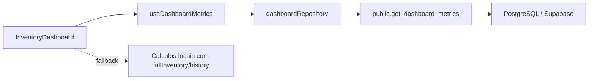

# P2.1 - RPCs Server-side para Dashboard

## Indice

1. [Resumo](#resumo)
2. [Escopo Implementado](#escopo-implementado)
3. [Arquitetura](#arquitetura)
4. [RPC Criada](#rpc-criada)
5. [Frontend](#frontend)
6. [Seguranca](#seguranca)
7. [Performance](#performance)
8. [Validacoes Executadas](#validacoes-executadas)
9. [Pendencias](#pendencias)

## Resumo

O dashboard passou a ter uma fonte server-side de metricas por unidade. A nova RPC `get_dashboard_metrics` consolida KPIs, graficos, alertas de validade, estoque critico e linha do tempo recente em uma unica chamada ao Supabase.

O frontend mantem fallback local: se a RPC ainda nao existir em algum ambiente, o dashboard continua funcionando com os dados ja carregados no cliente.

Status operacional: implementado no repositorio e aplicado manualmente no Supabase via SQL Editor.

## Escopo Implementado

| Frente | Status | Resultado |
| --- | --- | --- |
| RPC de dashboard | Implementado e aplicado manualmente | `public.get_dashboard_metrics(uuid)` retorna JSON agregado. |
| Checagem multi-tenant | Implementado | A RPC valida `auth.uid()` e membro aprovado na unidade. |
| Indices de apoio | Implementado | Indices por comodo, categoria, validade e movimentacoes recentes. |
| Repository frontend | Implementado | `src/repositories/dashboardRepository.ts`. |
| Hook frontend | Implementado | `src/hooks/useDashboardMetrics.ts`. |
| Dashboard com fallback | Implementado | Usa RPC quando disponivel e calculo local como fallback. |

## Arquitetura



## RPC Criada

Migration:

```text
supabase/migrations/20260519183000_dashboard_metrics_rpc.sql
```

Funcao:

```sql
public.get_dashboard_metrics(p_unidade_id uuid)
```

Retorno principal:

| Campo | Uso |
| --- | --- |
| `total_skus` | Quantidade de SKUs cadastrados. |
| `total_quantity` | Soma de quantidade dos itens ativos. |
| `critical_stock_count` | Itens consumiveis com quantidade menor ou igual a 1. |
| `expired_count` | Itens vencidos. |
| `urgent_expiry_count` | Itens vencendo em ate 7 dias. |
| `expiring_soon_count` | Itens vencendo entre 8 e 30 dias. |
| `today_activity_count` | Movimentacoes do dia. |
| `room_chart` | Serie agregada por comodo. |
| `category_chart` | Serie agregada por categoria. |
| `expired_items` | Lista limitada de vencidos. |
| `urgent_expiry_items` | Lista limitada de urgentes. |
| `expiring_soon_items` | Lista limitada de vencimentos proximos. |
| `critical_stock_items` | Lista limitada para reposicao sugerida. |
| `recent_movements` | Linha do tempo recente. |

## Frontend

Arquivos:

| Arquivo | Papel |
| --- | --- |
| `src/repositories/dashboardRepository.ts` | Chamada Supabase RPC e normalizacao de retorno. |
| `src/hooks/useDashboardMetrics.ts` | Estado de loading, erro e recarregamento. |
| `src/components/InventoryDashboard.tsx` | Consome metricas server-side com fallback local. |
| `src/OrdoDomus.tsx` | Ativa o hook ao abrir a aba dashboard. |
| `src/types/domain.ts` | Contrato `DashboardMetrics`. |

## Seguranca

A RPC usa `security definer`, mas nao retorna dados sem checagem explicita:

```sql
where m.unidade_id = p_unidade_id
  and m.user_id = auth.uid()
  and m.status = 'aprovado'
```

Tambem foram ajustadas permissoes:

```sql
revoke execute on function public.get_dashboard_metrics(uuid) from public;
revoke execute on function public.get_dashboard_metrics(uuid) from anon;
grant execute on function public.get_dashboard_metrics(uuid) to authenticated;
```

## Performance

Indices adicionados:

```sql
create index if not exists idx_itens_unidade_comodo_active
  on public.itens_inventario(unidade_id, comodo)
  where deletado_em is null;

create index if not exists idx_itens_unidade_categoria_active
  on public.itens_inventario(unidade_id, categoria)
  where deletado_em is null;

create index if not exists idx_movimentacoes_unidade_criado_desc
  on public.movimentacoes_inventario(unidade_id, criado_em desc);
```

Racional:

- reduz recomputacao no browser;
- evita trafego de inventario completo apenas para KPIs;
- usa indices parciais para itens ativos;
- limita listas operacionais retornadas.

## Validacoes Executadas

| Comando | Resultado |
| --- | --- |
| `npm run lint` | Passou. |
| `npm test` | Passou: 1 arquivo, 7 testes. |
| `npm run build` | Passou. |
| `npm audit --audit-level=high` | Passou: 0 vulnerabilidades. |
| `rg "\bany\b" src\hooks src\components src\services src\lib src\repositories -n` | Sem ocorrencias. |

## Pendencias

1. Validar o dashboard no app conectado ao banco remoto.
2. ✅ Historico de migrations reconciliado em 2026-05-23 com baseline inicial e `migration list` alinhado.
3. Implementar paginacao/filtros server-side no inventario.
4. Criar testes de repository com mocks do Supabase.
