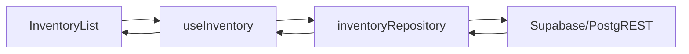

# P2.2 - Paginacao e Filtros Server-side no Inventario

## Indice

1. [Resumo](#resumo)
2. [Escopo Implementado](#escopo-implementado)
3. [Arquitetura](#arquitetura)
4. [Frontend](#frontend)
5. [Banco e Indices](#banco-e-indices)
6. [Filtros Disponiveis](#filtros-disponiveis)
7. [Validacoes Executadas](#validacoes-executadas)
8. [Pendencias](#pendencias)

## Resumo

O inventario deixou de filtrar e paginar apenas em memoria. A tela agora consulta o Supabase com `range`, `count: exact` e filtros server-side por texto, categoria, comodo, validade e estoque critico.

Status operacional: implementado no repositorio e aplicado manualmente no Supabase via SQL Editor.

## Escopo Implementado

| Frente | Status | Resultado |
| --- | --- | --- |
| Repository de inventario | Implementado | `src/repositories/inventoryRepository.ts`. |
| Hook de inventario | Implementado | `useInventory` controla pagina, page size, total e filtros. |
| UI de filtros | Implementado | Busca, categoria, comodo, validade e limpeza de filtros. |
| UI de paginacao | Implementado | Navegacao anterior/proxima e tamanho de pagina. |
| Indices de apoio | Implementado e aplicado manualmente | Trigram search, ordenacao, quantidade e filtros ativos. |

## Arquitetura



## Frontend

Arquivos alterados:

| Arquivo | Papel |
| --- | --- |
| `src/repositories/inventoryRepository.ts` | Monta query Supabase paginada e filtrada. |
| `src/hooks/useInventory.ts` | Estado de filtros, pagina, tamanho e total. |
| `src/components/InventoryList.tsx` | Controles visuais de filtros e paginacao. |
| `src/OrdoDomus.tsx` | Passa novos contratos para a tela de inventario. |
| `src/types/domain.ts` | Tipos `InventoryExpiryFilter`, `InventoryQueryParams`, `InventoryPageResult`. |

## Banco e Indices

Migration:

```text
supabase/migrations/20260519190000_inventory_server_side_filters_indexes.sql
```

Indices criados:

```sql
create index if not exists idx_itens_inventory_order_active
  on public.itens_inventario(unidade_id, comodo, nome)
  where deletado_em is null;

create index if not exists idx_itens_inventory_quantity_active
  on public.itens_inventario(unidade_id, quantidade)
  where deletado_em is null;
```

Tambem foram adicionados indices trigram para busca parcial em:

- `nome`;
- `categoria`;
- `comodo`;
- `armario`;
- `caixa`.

## Filtros Disponiveis

| Filtro | Implementacao |
| --- | --- |
| Busca geral | RPC `get_inventory_page` com `normalize_search_text` em `nome`, `categoria`, `comodo`, `armario`, `caixa`. |
| Categoria | RPC `get_inventory_page` com filtro parcial acento-insensivel em `categoria`. |
| Comodo | RPC `get_inventory_page` com filtro parcial acento-insensivel em `comodo`. |
| Vencidos | `validade_date < current_date`. |
| Vence em 7 dias | `validade_date` entre hoje e 7 dias. |
| Vence em 30 dias | `validade_date` entre hoje e 30 dias. |
| Sem validade | `validade_date is null`. |
| Estoque critico | `quantidade <= 1`. |

Atualizacao 2026-05-20:

- A busca textual passou a usar a RPC `public.get_inventory_page`.
- A migration `supabase/migrations/20260520200000_inventory_unaccent_search_rpc.sql` adiciona `unaccent`, funcao `public.normalize_search_text(text)` e indices trigram normalizados.
- Com isso, termos sem acento encontram valores gravados com acento, por exemplo `Agua` encontra `Água`.
- Status: SQL aplicado manualmente no Supabase em 2026-05-20.
- Validacao funcional confirmada em 2026-05-20: inventario voltou a carregar dados e a busca esta funcionando independentemente de acentos.

## Validacoes Executadas

| Comando | Resultado |
| --- | --- |
| `npm run lint` | Passou. |
| `npm test` | Passou: 1 arquivo, 7 testes. |
| `npm run build` | Passou. |
| `npm audit --audit-level=high` | Passou: 0 vulnerabilidades. |

## Pendencias

1. Validar a tela de inventario contra o banco remoto apos a aplicacao.
2. Reconciliar historico de migrations quando o `supabase db push` estiver estavel.
3. Evoluir para filtros por selecao de valores distintos, se o volume de categorias/comodos crescer.
4. Adicionar testes automatizados para `inventoryRepository` com mock de Supabase.
