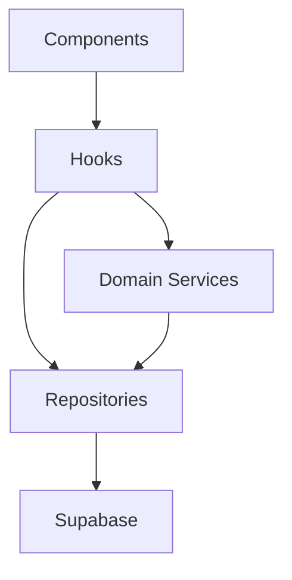

# P2.3 - Camada de Repository/Service

## Indice

1. [Resumo](#resumo)
2. [Escopo Implementado](#escopo-implementado)
3. [Arquitetura](#arquitetura)
4. [Repositories](#repositories)
5. [Services](#services)
6. [Hooks Refatorados](#hooks-refatorados)
7. [Validacoes Executadas](#validacoes-executadas)
8. [Pendencias](#pendencias)

## Resumo

Foi iniciada a separacao formal entre UI/hooks, acesso a dados e regras de negocio. O foco desta etapa foi o dominio de inventario, que concentra os fluxos mais sensiveis: edicao, exclusao, consumo, desfazer consumo, upsert e auditoria em `movimentacoes_inventario`.

## Escopo Implementado

| Frente | Status | Resultado |
| --- | --- | --- |
| Repository de auth | Implementado | `getCurrentUserId` isolado em `src/repositories/authRepository.ts`. |
| Repository de movimentacoes | Implementado | Insercao e leitura de historico em `src/repositories/movementRepository.ts`. |
| Repository de mutacoes de inventario | Implementado | Update, soft delete e quantidade em `src/repositories/inventoryMutationRepository.ts`. |
| Service de inventario | Implementado | Regras com auditoria em `src/services/inventoryService.ts`. |
| Hook de inventario | Refatorado | `useInventory` nao executa mais writes diretos em Supabase. |
| Hook de extracao | Parcialmente refatorado | Upsert e movimentacoes usam repositories compartilhados. |

## Arquitetura

## Repositories

| Arquivo | Responsabilidade |
| --- | --- |
| `src/repositories/authRepository.ts` | Obter usuario autenticado atual. |
| `src/repositories/inventoryRepository.ts` | Leitura paginada/filtros e RPC `upsert_inventario`. |
| `src/repositories/inventoryMutationRepository.ts` | Atualizacao, soft delete e quantidade de itens. |
| `src/repositories/movementRepository.ts` | Inserir e consultar movimentacoes de inventario. |
| `src/repositories/dashboardRepository.ts` | RPC `get_dashboard_metrics`. |

## Services

| Arquivo | Responsabilidade |
| --- | --- |
| `src/services/inventoryService.ts` | Orquestrar regra de negocio de inventario com auditoria. |

Fluxos cobertos:

- atualizar item com auditoria de ajuste/entrada/consumo;
- excluir item via soft delete com auditoria;
- consumir item com auditoria;
- desfazer consumo com auditoria.

## Hooks Refatorados

### `useInventory`

Antes:

- formatava payload;
- chamava Supabase diretamente;
- gravava movimentacao;
- atualizava UI/toast.

Agora:

- gerencia estado da tela;
- chama `inventoryService`;
- atualiza historico local;
- recarrega dados paginados.

### `useExtraction`

Mudancas:

- insercao de movimentacao passou para `movementRepository`;
- leitura de historico passou para `movementRepository`;
- RPC `upsert_inventario` passou para `inventoryRepository`.

## Validacoes Executadas

| Comando | Resultado |
| --- | --- |
| `npm run lint` | Passou. |
| `npm test` | Passou: 1 arquivo, 7 testes. |
| `npm run build` | Passou. |
| `npm audit --audit-level=high` | Passou: 0 vulnerabilidades. |
| `rg "\bany\b" src\hooks src\components src\services src\lib src\repositories -n` | Sem ocorrencias. |

## Pendencias

1. Refatorar `useAuth` para repositories/services de unidade e membros.
2. Refatorar `SaasAdminDashboard` para repository proprio.
3. Refatorar triagem/dicionario em repository dedicado.
4. Criar testes unitarios para `inventoryService`.
5. Remover logs operacionais sensiveis de `useExtraction`.
