# Implementation Plan Images v1

Criado em: 2026-06-03 21:28:00 -03:00
Modificado em: 2026-06-03 21:28:00 -03:00
Escopo: plano tecnico para inventario por foto de local, reaproveitando o fluxo de triagem de NFC-e/cupom do Ordo Domus.

## Objetivo

Permitir que o usuario tire uma foto de um local onde itens ja estao guardados, como geladeira, freezer, despensa, armario ou prateleira, e envie a imagem para IA identificar itens, estimar quantidades, sugerir categoria/local e, quando visivel, capturar validade.

O resultado nao deve entrar direto no estoque. Deve seguir o mesmo principio do fluxo de NFC-e: IA gera candidatos, usuario revisa em triagem, corrige dados ruins e so entao efetiva no inventario.

## Fontes tecnicas avaliadas

- Codigo atual:
  - `src/hooks/useReceiptImport.ts`
  - `src/services/geminiService.ts`
  - `src/lib/utils.ts`
  - `src/components/EntrySection.tsx`
  - `supabase/functions/extract-inventory/index.ts`
  - `supabase/functions/extract-inventory/limits.ts`
  - `supabase/migrations/20260521100000_receipt_import_finalize_rpc.sql`
  - `supabase/migrations/20260523100000_ai_extraction_rate_limits.sql`
- Plano inicial:
  - `plans/Implementation_plan_images.md`
- Documentacao externa consultada:
  - Gemini Image Understanding: https://ai.google.dev/gemini-api/docs/image-understanding
  - Gemini Structured Outputs: https://ai.google.dev/gemini-api/docs/structured-output
  - Gemini Video Understanding: https://ai.google.dev/gemini-api/docs/video-understanding
  - Supabase Edge Function Limits: https://supabase.com/docs/guides/functions/limits
  - MDN Barcode Detection API: https://developer.mozilla.org/en-US/docs/Web/API/Barcode_Detection_API
  - Open Food Facts API: https://openfoodfacts.github.io/openfoodfacts-server/api/

## Diagnostico do fluxo atual

O Ordo Domus ja possui uma base adequada para esta feature:

- O frontend captura imagem com `<input type="file" accept="image/*" capture="environment">`.
- `compressImage(file, 800)` converte a imagem para WebP no browser.
- `useReceiptImport` gera hash, chama `extractInventoryDataFromReceipt`, salva itens em `importacoes_pendentes` e abre caminho para triagem.
- `geminiService` centraliza chamada a `supabase.functions.invoke('extract-inventory')`.
- A Edge Function `extract-inventory` ja aceita `text`, `audio` e `receipt`.
- `limits.ts` ja valida payload, MIME e tamanho por modo.
- Existe rate limit operacional em `ai_extraction_events`.
- Existe consentimento local em `useAiConsent`.
- A triagem ja efetiva itens com RPC e dicionario de produtos.

Conclusao: a melhor abordagem e adicionar um novo modo de IA e especializar a triagem, nao criar um fluxo paralelo.

## Decisao recomendada de produto

Nome funcional:

- "Foto do local" ou "Inventario por foto".

Nome tecnico:

- `mode: "snapshot"` na Edge Function.
- Escopo de consentimento: `snapshot`.
- Origem de triagem: `snapshot`.

Regra central:

- A IA pode sugerir item, quantidade, categoria, local e validade.
- O app deve tratar tudo como sugestao, especialmente quantidade e validade.
- Itens identificados com baixa confianca devem aparecer destacados na triagem.

## Ferramentas necessarias

### IA principal

Usar Gemini multimodal via Edge Function, mantendo o segredo `GEMINI_API_KEY` no backend. A documentacao oficial do Gemini confirma suporte a entendimento de imagem, envio de imagem inline em Base64 e uso de imagem com prompt. Tambem confirma structured outputs com JSON Schema, que e exatamente o padrao ja usado no app.

Recomendacao pratica:

- MVP: manter os modelos ja configurados no projeto, com prioridade para `gemini-2.5-flash` e fallback para `gemini-flash-latest`.
- Planejamento futuro: avaliar troca controlada para a familia mais recente documentada pelo Google, mas so depois de testes de regressao de schema, custo e qualidade.

### Backend

- Supabase Edge Function `extract-inventory`.
- Tabela `ai_extraction_events` para rate limit por usuario/unidade/modo.
- Tabela `importacoes_pendentes` para triagem, idealmente generalizada para varias origens.
- RPC `efetivar_importacao_cupom`, ou uma nova RPC com nome mais generico para efetivar qualquer item de triagem.

### Frontend

- `<input type="file" accept="image/*" capture="environment">` para foto no celular.
- Canvas/WebP para compressao local.
- Consentimento de IA especifico para foto de local.
- Reuso do modal/tela de triagem.
- UI de local antes da foto: comodo, armario e caixa/prateleira sugeridos.

### Ferramentas opcionais

- Barcode Detection API no browser, com fallback porque a API e experimental e deve ter compatibilidade verificada por navegador.
- Biblioteca de barcode como fallback quando a API nativa nao estiver disponivel, por exemplo `@zxing/browser`.
- Open Food Facts para enriquecer produtos alimenticios por codigo de barras quando houver EAN/UPC.
- Modo video curto no futuro, porque Gemini pode analisar video com informacoes visuais e de audio, mas isso aumenta payload, custo e tempo de resposta.

## Arquitetura proposta

```mermaid
flowchart LR
  U["Usuario fotografa local"] --> FE["Frontend comprime imagem"]
  FE --> C["Consentimento IA snapshot"]
  C --> EF["Supabase Edge Function extract-inventory"]
  EF --> RL["Rate limit ai_extraction_events"]
  RL --> G["Gemini multimodal + schema JSON"]
  G --> FE2["Itens candidatos"]
  FE2 --> DB["importacoes_pendentes origem=snapshot"]
  DB --> T["Triagem"]
  T --> RPC["Efetivar item"]
  RPC --> INV["Inventario + movimentacao"]
```



## Modelo de resposta da IA

Recomendacao de schema para `snapshot`:

```json
{
  "type": "ARRAY",
  "items": {
    "type": "OBJECT",
    "properties": {
      "item": { "type": "STRING" },
      "categoria": { "type": "STRING" },
      "quantidade": { "type": "NUMBER" },
      "comodo": { "type": "STRING" },
      "armario": { "type": "STRING" },
      "caixa": { "type": "STRING" },
      "validade": { "type": "STRING" },
      "marca": { "type": "STRING" },
      "codigo_barras": { "type": "STRING" },
      "confianca": { "type": "NUMBER" },
      "observacao": { "type": "STRING" }
    },
    "required": ["item", "categoria", "quantidade", "confianca"]
  }
}
```

Observacoes:

- `validade` deve ser vazia quando nao estiver legivel.
- `confianca` deve variar de 0 a 1.
- `observacao` deve explicar incertezas, por exemplo "rotulo parcialmente oculto" ou "quantidade estimada por embalagens visiveis".
- `comodo`, `armario` e `caixa` devem vir preferencialmente do contexto selecionado pelo usuario, nao apenas da inferencia visual.

## Prompt recomendado

Objetivo do prompt:

- Identificar produtos visiveis.
- Agrupar embalagens aparentemente identicas.
- Estimar quantidade somente pelo que esta visivel.
- Nao inventar itens ocultos.
- Capturar validade apenas se estiver legivel.
- Sinalizar baixa confianca.

Exemplo de diretriz para a Edge Function:

```text
Analise a foto de um local de armazenamento domestico. Liste apenas itens fisicamente visiveis. Agrupe embalagens identicas ou claramente equivalentes. Estime quantidade pelo numero de unidades visiveis, sem inferir itens escondidos. Se houver data de validade legivel na embalagem, retorne em formato brasileiro DD/MM/YYYY ou MM/YYYY; se nao estiver legivel, retorne string vazia. Use categorias curtas para inventario domestico. Use o contexto de local informado pelo usuario quando existir. Para cada item, informe confianca entre 0 e 1 e observacao curta quando houver incerteza.
```

## Mudancas de banco

O fluxo atual usa `importacoes_pendentes` com nomes ligados a cupom. Para snapshot, ha duas alternativas.

### Alternativa A - MVP com menor mudanca

Reusar `importacoes_pendentes` e adicionar colunas opcionais:

- `origem text default 'receipt' check (origem in ('receipt', 'snapshot', 'barcode', 'video'))`
- `source_hash text`
- `source_importado_em timestamptz`
- `source_metadata jsonb`
- `confianca numeric`
- `validade_sugerida text`
- `comodo_sugerido text`
- `armario_sugerido text`
- `caixa_sugerida text`

Manter `cupom_hash` por compatibilidade, mas passar a usar `source_hash` nos novos fluxos.

### Alternativa B - Arquitetura mais limpa

Criar uma tabela generica:

- `triagens_importacao`
  - `id`
  - `unidade_id`
  - `origem`
  - `source_hash`
  - `source_metadata`
  - `criado_por`
  - `criado_em`
  - `expires_at`
- `triagem_itens`
  - `id`
  - `triagem_id`
  - `nome_bruto`
  - `categoria_sugerida`
  - `quantidade`
  - `valor_unitario`
  - `validade_sugerida`
  - `local_sugerido`
  - `confianca`
  - `observacao`
  - `processado`

Recomendacao: para o estado atual do app, usar Alternativa A no MVP e planejar Alternativa B como refactor posterior. Isso reduz risco e aproveita a triagem existente.

## Mudancas no backend

### `supabase/functions/extract-inventory/limits.ts`

- Expandir `ExtractionMode` para `'text' | 'audio' | 'receipt' | 'snapshot'`.
- Adicionar `RATE_LIMIT_DEFAULTS.snapshot`.
- Sugerido:
  - `maxRequests`: 8 por hora.
  - `windowSeconds`: 3600.
  - `maxPayloadBytes`: 8 MB no MVP.
  - MIME: `image/webp`, `image/jpeg`, `image/png`, `image/heic`, `image/heif`.
- Ajustar mensagens de erro para "foto de local".

### `supabase/functions/extract-inventory/index.ts`

- Aceitar `mode === "snapshot"`.
- Validar usuario autenticado e admin aprovado, seguindo o padrao atual.
- Registrar eventos em `ai_extraction_events` com modo `snapshot`.
- Adicionar `snapshotResponseSchema`.
- Adicionar prompt de foto de local.
- Receber payload:

```json
{
  "mode": "snapshot",
  "unidadeId": "...",
  "imageBase64": "...",
  "mimeType": "image/webp",
  "context": {
    "comodo": "Cozinha",
    "armario": "Geladeira",
    "caixa": "Prateleira 2"
  }
}
```

### Migration de rate limit

Atualizar check constraint de `ai_extraction_events.mode` para incluir `snapshot`.

Exemplo conceitual:

```sql
alter table public.ai_extraction_events
  drop constraint if exists ai_extraction_events_mode_check;

alter table public.ai_extraction_events
  add constraint ai_extraction_events_mode_check
  check (mode in ('text', 'audio', 'receipt', 'snapshot'));
```

Registrar tudo em `docs/supabase/SQL_MUDANCAS.md`.

## Mudancas no frontend

### Serviço de IA

Em `src/services/geminiService.ts`:

- Expandir `ExtractionMode` com `snapshot`.
- Criar `ExtractedSnapshotItem`.
- Criar `extractInventoryDataFromSnapshot(imageBase64, mimeType, unidadeId, context)`.

### Hook dedicado

Criar `src/hooks/useSnapshotImport.ts` ou generalizar `useReceiptImport` para `useVisualImport`.

Recomendacao:

- Criar hook dedicado no MVP para reduzir risco.
- Extrair helpers compartilhados depois:
  - compressao de imagem;
  - hash;
  - insert em triagem;
  - mensagens toast.

Fluxo do hook:

1. Verificar `unidadeId`.
2. Pedir consentimento `snapshot`.
3. Comprimir imagem com largura maior que cupom, por exemplo 1400 ou 1600 px.
4. Gerar `source_hash` da imagem comprimida.
5. Chamar IA com `mode: snapshot`.
6. Filtrar itens vazios ou confianca muito baixa.
7. Inserir em `importacoes_pendentes` com `origem='snapshot'`.
8. Avisar usuario e abrir triagem.

### UI de entrada

Em `EntrySection`:

- Adicionar botao "Foto do local" ao lado de "Importar Cupom".
- Usar icone `Camera` ou `ImagePlus` de `lucide-react`.
- Separar input de arquivo de cupom e snapshot para mensagens e handlers independentes.
- Antes da captura, permitir selecionar local:
  - comodo;
  - armario;
  - caixa/prateleira.

Evitar colocar longas explicacoes visiveis na UI. O fluxo deve ser direto: selecionar local, tocar em foto, revisar triagem.

### Triagem

Em `TriageModal` / `useTriage`:

- Mostrar origem do item: Cupom, Foto do local, Barcode, Video.
- Para `snapshot`, exibir `confianca` e `observacao`.
- Destacar validade sugerida quando existir.
- Permitir "scan rapido de validade" no item.
- Permitir descarte em massa de itens de baixa confianca.

## Validade

Fotos amplas raramente capturam validade com confianca, porque ela costuma ficar em tampa, fundo, dobra ou selo lateral. O plano deve tratar validade como recurso oportunista, nao como promessa.

Recomendacao:

- Se a validade estiver claramente visivel: preencher `validade_sugerida`.
- Se estiver parcialmente legivel: deixar campo vazio e colocar observacao.
- Na triagem, oferecer botao por item "Ler validade" para foto aproximada do carimbo.
- O "scan rapido de validade" pode usar o mesmo `snapshot` com submodo `expiry`, ou um novo `mode: "expiry"`.
- Validar formato com a mesma normalizacao ja usada no app antes de persistir.

## Ideias complementares para "ler algo ja guardado"

### 1. Foto unica do local

MVP recomendado. Boa para itens visiveis e organizados. Limitacao: oclusao e rotulos virados.

### 2. Foto por prateleira

Melhor que uma foto ampla da despensa inteira. O app pode guiar o usuario:

- "Prateleira 1"
- "Prateleira 2"
- "Porta da geladeira"
- "Gaveta inferior"

Cada foto entra como lote de triagem separado, com o local ja preenchido.

### 3. Video curto de varredura

Futuro. Um video de 5 a 10 segundos pode revelar itens que uma foto nao mostra. Gemini consegue analisar video usando fluxos visual e de audio, mas o payload e o custo sobem, e o Supabase Edge Function tem limites de memoria/duracao que exigem cuidado.

### 4. Foto + audio

Muito promissor:

- Usuario tira foto.
- Usuario fala "tem tres leites, dois vencem em julho e um em agosto".
- IA usa imagem para identificar e audio para corrigir quantidade/validade.

Este modo reduz friccao quando a validade nao esta visivel.

### 5. Codigo de barras

Bom para cadastro preciso de produtos embalados.

- Tentar `BarcodeDetector` nativo quando suportado.
- Usar fallback com biblioteca de barcode.
- Consultar Open Food Facts por EAN/UPC para nome, marca, categoria e imagem do produto.
- Nao depender disso para todos os produtos, porque cobertura no Brasil pode variar por item.

### 6. Comparacao com estoque existente

Ao importar uma foto de local, a IA pode comparar candidatos com itens ja existentes naquele comodo/armario/caixa e sugerir:

- "Somar quantidade a item existente"
- "Criar novo item"
- "Possivel duplicata"

Isso deve ser feito na triagem, nao diretamente pela IA.

## Privacidade e seguranca

- Atualizar consentimento de IA para incluir foto de local.
- Explicar que a imagem pode conter ambiente domestico e sera enviada para processamento por IA.
- Nao persistir imagem bruta no banco no MVP.
- Persistir apenas itens extraidos, hash da imagem comprimida e metadados minimos.
- Sanitizar logs para nunca registrar `imageBase64`.
- Manter rate limit por usuario/unidade/modo.
- Nao permitir snapshot para convidado se a regra atual de IA exige admin aprovado.

## Observabilidade

Adicionar breadcrumb/span com `mode=snapshot`, sem payload:

- tempo de compressao local;
- tempo de Edge Function;
- quantidade de itens extraidos;
- quantidade de itens descartados por baixa confianca;
- taxa de erro por MIME/tamanho/rate limit.

## Testes

### Unitarios

- `limits.test.ts`: aceita snapshot WebP valido.
- `limits.test.ts`: rejeita snapshot com MIME invalido.
- `limits.test.ts`: rejeita snapshot acima do limite.
- Helper de normalizacao: validade visivel, validade vazia, quantidade minima 1.

### Edge Function

- Mock de Gemini retornando itens snapshot.
- Verificar que schema retorna array.
- Verificar que `snapshot` registra evento em `ai_extraction_events`.
- Verificar erro se modo nao estiver incluido na constraint.

### Frontend

- Hook `useSnapshotImport`: sem consentimento nao chama IA.
- Hook `useSnapshotImport`: com resultado valido insere triagem.
- E2E autenticado com mock de `extract-inventory`:
  - clicar "Foto do local";
  - enviar fixture de imagem;
  - confirmar que itens entram em triagem;
  - abrir triagem e efetivar um item.

### Manual

- Foto de prateleira organizada.
- Foto de geladeira com itens parcialmente ocultos.
- Foto de validade aproximada.
- Foto escura ou tremida.
- Foto com produto repetido.

## Plano de implementacao

### Fase 0 - Decisoes

- Confirmar nome de produto: "Foto do local".
- Confirmar se MVP usa somente foto ou foto + audio.
- Confirmar limite de imagem: 1400 px ou 1600 px.
- Confirmar se snapshot fica restrito a admin, seguindo o padrao atual.

### Fase 1 - Banco e docs SQL

- Migration para `ai_extraction_events.mode` incluir `snapshot`.
- Migration para metadados de origem em `importacoes_pendentes`.
- Documentar em `docs/supabase/SQL_MUDANCAS.md`.
- Aplicar migration no DB SQL quando aprovado para implementacao.

### Fase 2 - Backend IA

- Adicionar `snapshot` em `limits.ts`.
- Adicionar schema e prompt em `index.ts`.
- Atualizar testes de limits.
- Validar retorno com imagem fixture.

### Fase 3 - Frontend captura

- Criar `useSnapshotImport`.
- Adicionar service em `geminiService`.
- Adicionar consentimento `snapshot`.
- Adicionar botao e input em `EntrySection`.
- Adicionar selecao simples de local.

### Fase 4 - Triagem

- Exibir origem, confianca e observacao.
- Preencher local sugerido.
- Preencher validade sugerida quando houver.
- Permitir scan rapido de validade como melhoria opcional.

### Fase 5 - Testes e release

- Rodar:

```powershell
npm run lint
npm test
npm run build
npm run test:e2e
```

- Validar com imagem real pequena e imagem real de local cheio.
- Atualizar issue GitHub correspondente ou criar issue se ainda nao existir.
- Atualizar `docs/RESUMO_DIARIO.md`.

## Avaliacao da versao inicial `Implementation_plan_images.md`

Pontos fortes:

- A ideia central esta correta: foto de local deve reaproveitar o fluxo de NFC-e/triagem.
- A escolha de Gemini multimodal e coerente com a stack atual.
- O plano percebe corretamente que foto de despensa/geladeira exige resolucao maior que cupom.
- As ideias de video, foto + audio, scan rapido de validade e codigo de barras sao boas extensoes.

Pontos que precisam ajuste:

- O plano inicial ainda trata a mudanca como "adicionar um modo e conectar na tabela", mas nao detalha a generalizacao de `importacoes_pendentes`, que hoje possui campos especificos de cupom.
- Falta separar MVP de evolucoes. Video e audio sao bons, mas nao devem entrar obrigatoriamente no primeiro corte.
- Falta explicitar confianca da IA e observacao por item, essenciais porque foto de local tem muito mais ambiguidade que cupom.
- Falta tratar validade como dado oportunista, nao garantido.
- Falta atualizar `ai_extraction_events.mode`, `useAiConsent`, testes de `limits.ts` e observabilidade.
- A sugestao de Barcode Detection precisa mencionar compatibilidade experimental e fallback.

Recomendacao final:

- Usar esta v1 como plano de execucao.
- Manter a versao inicial como brainstorming valido.
- Comecar por foto unica + triagem + confianca, e deixar video/foto+audio/codigo de barras como fases posteriores.
